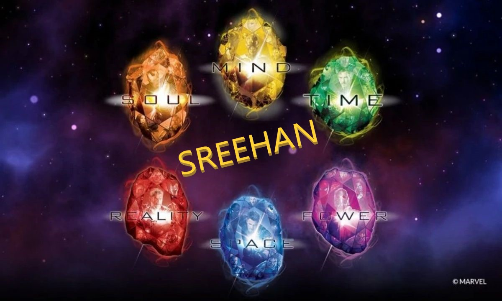
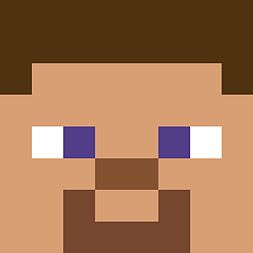

<html>
<head>
<meta name="viewport" content="width=device-width, initial-scale=1">
   

</head>
<body>

<!-- MAIN (Center website) -->

<h1 class="glow">My Collection of images</h1>

<h2 class="glow">Images</h2>

  <button class="btn active" onclick="filterSelection('all')"> Show all</button>
  <button class="btn" onclick="filterSelection('Space')"> Space</button>
  <button class="btn" onclick="filterSelection('Painting')"> Painting</button>
  <button class="btn" onclick="filterSelection('Minecraft')"> Minecraft</button>
  <button class="btn" onclick="filterSelection('Colorful')"> Colorful</button>
  <button class="btn" onclick="filterSelection('Special')"> Special</button>

<!-- Portfolio Gallery Grid -->

  

    

      
      <h4></h4>
      

    

  

  

    

    
     

  

  

    

    
      
    

  

  
  

    

      
      
    

  

  

    

    
      
    

  

  

    

    
      
    

  

  

    

      
      
    

  

  

    

    
      
    

  

  

    

    
     
    

  

  
  
  

    

      
      <h4></h4>
      

    

  

  
  
  

    

      
      <h4></h4>
      

    

  

  
 
  

    

      
      <h4></h4>
      

    

  

 
 

 <h3>Coming soon!</h3>
     
 <svg height="200" width="500">
  <defs>
    <linearGradient id="grad1" x1="10%" y1="0%" x2="100%" y2="0%">
      <stop offset="0%"
      style="stop-color:rgb(255,255,0);stop-opacity:1" />
      <stop offset="100%"
      style="stop-color:rgb(255,0,0);stop-opacity:1" />
    </linearGradient>
  </defs>
  <ellipse cx="100" cy="70" rx="85" ry="55" fill="url(#grad1)" />
  <text fill="#0000ff" font-size="35" font-family="Verdana"
  x="50" y="80">THANK YOU</text>
</svg> 

  
 
<!-- END GRID -->

<!-- END MAIN -->

    
